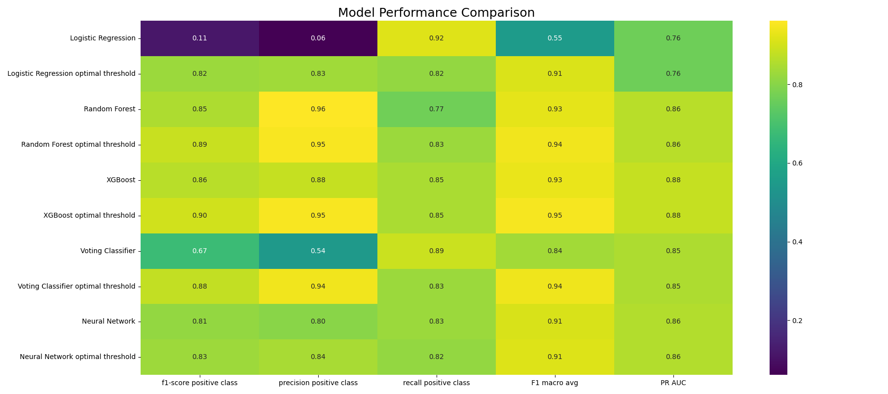

# 💳 Credit Card Fraud Detection — End-to-End Machine Learning System

Fraud detection is a highly **imbalanced binary classification problem**, where fraudulent transactions represent less than **0.18%** of all records.  
This project provides a **full production-ready fraud detection pipeline** built using:

- Classical Machine Learning models
- Ensemble Learning
- Deep Learning with Focal Loss
- Advanced resampling techniques
- Automated evaluation & model comparison
- Streamlit web interface for training and prediction

---

# 📁 Project Structure

```
.
├── data
│   └── processed
│       ├── raw
│       │   └── creditcard.csv
│       ├── test.csv
│       └── train.csv
├── LICENSE
├── models
│   └── saved_models
│       ├── focal_nn_model.pt
│       ├── logistic_model.pkl
│       ├── random_forest_model.pkl
│       ├── voting_classifier_model.pkl
│       └── xgboost_model.pkl
├── notebooks
│   ├── 01_EDA.ipynb
│   └── 02_model_baseline.ipynb
├── page_predict.py
├── page_train.py
├── __pycache__
│   ├── page_predict.cpython-310.pyc
│   └── page_train.cpython-310.pyc
├── README.md
├── reports
│   ├── best_model.txt
│   ├── Logistic Regression_optimal_report.txt
│   ├── Logistic Regression_report.txt
│   ├── model_comparison.csv
│   ├── model_comparison_heatmap.png
│   ├── Neural_Network_optimal_report.txt
│   ├── Neural_Network_report.txt
│   ├── plots
│   │   ├── logistic_regression_cm.png
│   │   ├── logistic_regression_hist.png
│   │   ├── logistic_regression_pr.png
│   │   ├── logistic_regression_roc.png
│   │   ├── random_forest_cm.png
│   │   ├── random_forest_hist.png
│   │   ├── random_forest_pr.png
│   │   └── random_forest_roc.png
│   ├── Random Forest_optimal_report.txt
│   ├── Random Forest_report.txt
│   ├── Voting Classifier_optimal_report.txt
│   ├── Voting Classifier_report.txt
│   ├── XGBoost_optimal_report.txt
│   └── XGBoost_report.txt
├── requirements.txt
├── src
│   ├── config
│   │   └── settings.yaml
│   ├── data
│   │   ├── __init__.py
│   │   ├── load_data.py
│   │   ├── __pycache__
│   │   │   └── load_data.cpython-310.pyc
│   │   └── split.py
│   ├── __init__.py
│   ├── main.py
│   ├── models
│   │   ├── foacl
│   │   │   ├── focal_loss.py
│   │   │   └── fraud_nn.py
│   │   ├── __pycache__
│   │   │   ├── focal_loss.cpython-310.pyc
│   │   │   ├── fraud_nn.cpython-310.pyc
│   │   │   ├── random_forest.cpython-310.pyc
│   │   │   ├── voting_classifier.cpython-310.pyc
│   │   │   └── xgboost_model.cpython-310.pyc
│   │   ├── random_forest.py
│   │   ├── voting_classifier.py
│   │   └── xgboost_model.py
│   ├── pipelines
│   │   ├── evaluate.py
│   │   ├── focal
│   │   │   └── train_focal.py
│   │   ├── model_selector.py
│   │   ├── __pycache__
│   │   │   ├── evaluate.cpython-310.pyc
│   │   │   ├── model_selector.cpython-310.pyc
│   │   │   ├── trainer.cpython-310.pyc
│   │   │   └── train_focal.cpython-310.pyc
│   │   └── trainer.py
│   ├── __pycache__
│   │   ├── __init__.cpython-310.pyc
│   │   └── page_train.cpython-310.pyc
│   └── utils
│       ├── metrics_extended.py
│       ├── plot_all.py
│       ├── preprocess.py
│       ├── __pycache__
│       │   ├── metrics_extended.cpython-310.pyc
│       │   ├── plot_all.cpython-310.pyc
│       │   ├── plot_curves.cpython-310.pyc
│       │   ├── preprocess.cpython-310.pyc
│       │   ├── resampling.cpython-310.pyc
│       │   └── save_load.cpython-310.pyc
│       ├── resampling.py
│       └── save_load.py
└── streamlit_app.py
```

---

# 🔧 Installation

### 1️⃣ Clone the repository

```bash
git clone https://github.com/ahmedkhalidak/fraud-detection.git
cd fraud-detection
```

### 2️⃣ Create a Conda environment

```
conda create -n fraud-env python=3.10 -y
conda activate fraud-env
```

### 3️⃣ Install dependencies

```
pip install -r requirements.txt
```

# 📥 Dataset Setup

Download the dataset from Kaggle:

🔗 https://www.kaggle.com/datasets/mlg-ulb/creditcardfraud

- Place creditcard.csv inside:

```
data/raw/creditcard.csv
```

- Then generate train/test split:

```
python src/data/split.py
```

# 🔍 Exploratory Data Analysis

### Key observations:

- No missing values

- PCA-transformed features `V1–V28`

- Highly imbalanced dataset:
  - Class 0 (Normal): `284,315` samples
  - Class 1 (Fraud): `492` samples

# 🧱 Baseline Models

| Model               | Notes                         |
| ------------------- | ----------------------------- |
| Logistic Regression | Strong recall, weak precision |

# 🔥 Deep Learning with Focal Loss

Standard BCE struggles with extreme imbalance.
Focal Loss helps focus on minority (fraud) samples :

```
loss = α * (1 - pt)^γ * BCE
```

# 📊 Model Evaluation

ROC Curves

Logistic Regression

Random Forest

XGBoost

Voting Classifier

Focal Neural Network

# 🔥 Model Comparison (Heatmap)



Includes:

- F1-score (fraud class)

- Recall

- Precision

- Macro F1

- PR-AUC

- Optimal threshold metrics

# 🧪 Streamlit Web Application

- A full interactive interface to:

- Train models

- Apply SMOTE, undersampling, SMOTE+ENN

- Visualize ROC, PR, confusion matrix

- Run model comparison

- Save & load models

- Predict single transactions or batch CSV

- Run the app:

```
streamlit run streamlit_app.py
```


# 🏆 Best Model Selection

### Automatically selects the best-performing model based on:

- F1-score (fraud class)

- PR-AUC

- Recall weighting

### And The Best Model -> Random Forest with best Threshold

Written to:

```
reports/best_model.txt
```

# 🧠 System Architecture

```
flowchart TD

A[Raw Dataset] --> B[Preprocessing & Scaling]
B --> C[Train/Test Split]
C --> D[Baseline Models]
C --> E[Resampling Techniques]
C --> F[Focal Loss Neural Network]

D --> G[Evaluation]
E --> G
F --> G

G --> H[Model Comparison Engine]
H --> I[Best Model Selector]
I --> J[Streamlit App]
```

# 📦 Saved Models

Exported models stored in:

```
models/saved_models/

```
